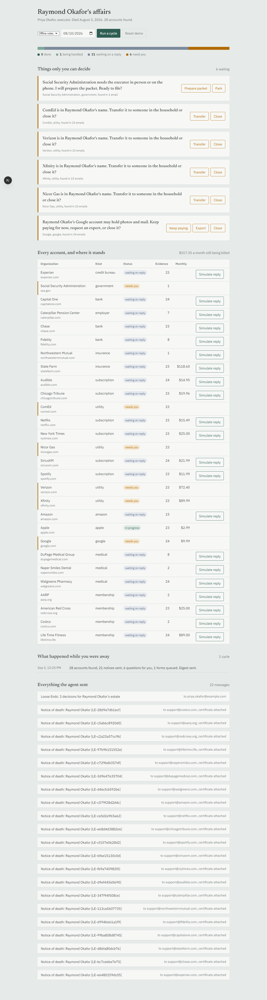

# Loose Ends

**An agent that handles the admin after someone dies.**

When someone dies, the executor inherits 50 to 100 notifications, cancellations and follow-ups that drag on for nearly two years. Loose Ends reads the inbox, finds every account, sends the notices, chases the ones that never reply, and interrupts the executor only for the two or three decisions a day that are actually theirs.

Built with [Strands Agents](https://strandsagents.com) for the AWS Agents for Humans hackathon. Track: Everyday Agents. Spec: [docs/spec.md](docs/spec.md).

## What works today

- Discovery from a JSON mailbox (Gmail Takeout `.mbox` import coming), classification in batches with a Strands agent and structured output, aggregation by sender domain with evidence.
- Playbooks per category (credit bureaus, banks, utilities, subscriptions, Facebook, Google, Apple, Amazon, medical, memberships, employers, government) encoding what actually works with each kind of organization.
- Dispatch: email playbooks are drafted and sent with the certificate attached; utilities and anything needing paper or a phone call become an executor decision; answered decisions resume on the next cycle.
- Follow-up: vendor replies are classified (closed, needs documents, wrong channel, denied); silence gets a second notice, then escalates.
- One digest a day with at most three decisions and the progress counts.
- Ghost Watch: after the notices go out, new mail is watched for charges on closed accounts, accounts opened in the deceased's name, and credit inquiries. Each hit gets a drafted dispute and a one-tap decision.
- Money Recovered: recurring billing stopped, refunds asked for, and hours the executor did not have to spend.
- A vendor-action agent for web forms and phone calls: a Strands agent with tools, gated by a `HumanInTheLoop` intervention whose approval is deferred into the ledger, so a background cycle never blocks and the executor's answer on a later cycle lets the tool run.
- Gmail Takeout `.mbox` import alongside the JSON mailbox.
- An offline brain (rule-based classifier, template drafter) so the whole loop runs with no credentials.

## Run the demo locally

```
uv sync
uv run pytest
uv run loose-ends init --demo
uv run loose-ends cycle --brain offline --today 2026-08-10
uv run loose-ends status
uv run loose-ends answer <decision-id> transfer
uv run loose-ends reply <account-id> --body "We have closed the account and issued a refund."
uv run loose-ends cycle --brain offline --today 2026-08-18
```

Sent mail lands in `data/local/mail/sent/`. The ledger is `data/local/ledger/<estate>.json`.

## Dashboard

The executor's view: one progress bar, the questions only they can answer, every account and where it stands, what happened while they were away, and everything the agent sent.

```
uv run uvicorn loose_ends.api:app --reload --port 8000     # API, terminal 1
cd web && npm install && npm run dev                        # dashboard, terminal 2
```

Open http://localhost:3000, click "Start the demo", then "Run a cycle". The date picker moves the clock forward so follow-ups and escalations can be shown in minutes instead of weeks.



To use Bedrock instead of the offline brain, configure AWS credentials for `us-east-1`, accept the Claude Sonnet 5 Marketplace agreement in the Bedrock console, then:

```
uv run loose-ends cycle --brain bedrock
```

Set `LOOSE_ENDS_MODEL_ID` to use a different model (for example `us.anthropic.claude-sonnet-4-6`).

## Demo data

`data/synthetic/raymond_okafor.json` is a generated inbox: 24 months of mail for a fictional retiree in the Chicago suburbs, from 36 senders, with the tricky cases on purpose (a joint account with the surviving spouse, a subscription billed to a son's card, a life insurance policy that appears once, a gym that only cancels on paper). Regenerate with `uv run python data/synthetic/generate_inbox.py`.

## Guardrails

The agent identifies itself as an assistant acting for the named executor and never writes as the deceased. It never moves money, closes financial accounts, or gives legal advice. Every irreversible step needs a human tap. Everything sent is in the ledger.

## Layout

```
src/loose_ends/
  schema.py         ledger records
  ledger.py         file-backed ledger (DynamoDB implementation to come, same interface)
  discovery.py      mailbox loading, batch classification, aggregation
  playbooks.py      playbook loader and deterministic planner
  correspondence.py notice drafting and sending
  dispatch.py       priority walk, decisions, resume
  followup.py       reply classification, chase, escalate
  digest.py         the daily email
  cycle.py          one background cycle as stage functions
  graph.py          the same stages as a Strands Graph
  ghostwatch.py     post-death monitoring
  money.py          Money Recovered
  actions.py        vendor-action agent with deferred HumanInTheLoop
  brain.py          the three judgment calls, offline or Bedrock
  api.py            FastAPI layer for the dashboard
  runtime.py        AgentCore Runtime entrypoint
  vendors.py        vendor directory, offline classifier and drafter
  cli.py            command line
data/playbooks/     one YAML per category
data/synthetic/     demo inbox and generator
```

MIT license.
