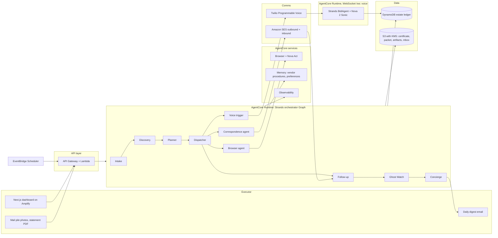

# Loose Ends (v2)

**An agent that handles the admin after someone dies.**
Built with Strands Agents, deployed on Amazon Bedrock AgentCore.

Hackathon: AWS Agents for Humans (Devpost). Track: Everyday Agents.
Deadline: Monday Sep 14, 2026, 5:00 pm PT (7:00 pm CDT). Credits form closes Sep 11, 12:00 pm PT.
Team: 4. Build window: Sep 1 to Sep 13.

### What changed from v1 (read this first)

1. **Scope cut to one perfect loop.** Discover, plan, notify, read the reply, chase, digest, decide, resume. Everything else is a stretch with a recorded fallback. v1 had nine agents, two runtimes, three mailbox adapters and Cognito all in the MVP. That is a half-working demo waiting to happen.
2. **Discovery no longer depends on the inbox password.** Added two discovery channels that executors actually have: a photo of the mail pile on the kitchen counter, and a bank or card statement PDF. The inbox stays the richest source, but the product works without it.
3. **Three features nobody in the market has**, verified by a competitor scan on Sep 2, 2026: Ghost Watch (post-death identity-theft and zombie-billing monitoring), the Money Recovered counter (refunds, stopped charges, hours saved), and Vendor Memory (the agent learns each vendor's real procedure from replies and folds it back into community-editable playbooks).
4. **Competitive section rewritten from product reality, not marketing.** Alix and Empathy are human specialists with AI assist. Elayne is the closest commercial analogue. Nobody parses the deceased's email, nobody makes the phone call, nobody runs in the background with a decision digest.
5. **Technical claims verified against current docs** (Strands interrupts and `HumanInTheLoop`, `BidiAgent` with Nova 2 Sonic, AgentCore Runtime WebSocket, AgentCore CLI, Bedrock model IDs). Corrections are inline in section 7.
6. **Evidence refreshed** with Empathy's 2025 Grief Tax report and CDC 2025 provisional deaths.
7. **Voice is recorded by Sep 9 or it is a slide.** The call is the signature moment of the video, so it gets a hard date and a fallback, not a wish.

---

## 1. The pitch in three lines

**Problem.** When someone dies, a grieving relative inherits somewhere between 50 and 100 notifications, cancellations, closures and follow-ups, and they drag on for nearly two years.

**Who.** The executor or next of kin, usually an adult child or a surviving spouse. About 3.1 million people die in the US each year, so roughly that many households start this job annually. Second audience: funeral homes and hospices that want something real to hand families in the aftercare packet.

**Why it matters.** Empathy's research puts the work at about 420 hours, roughly five phone calls a week, and around 20 months for executors. Executors are overwhelmingly women (68%), most were the primary caregiver, and 75% report panic attacks. Nobody should be on hold with a cable company the week their mother dies.

## 2. What the agent does

You give Loose Ends the death certificate and whatever you have: the inbox, a photo of the mail pile, a bank statement. It finds every account, works out what each one needs, sends the notifications, cancels what should be cancelled, calls who has to be called, chases the ones that never reply, watches for anyone still billing or impersonating the person, and only interrupts you for decisions that are actually yours.

The loop runs on a schedule in the background. There is no app to babysit.

1. **Discover** accounts from the inbox, mail photos and statements.
2. **Plan** a playbook per account and assemble the authority packet once.
3. **Execute** through email, browser forms, or a phone call.
4. **Follow up** by reading replies, rescheduling, and escalating.
5. **Watch** for zombie charges and identity-theft signals after the notifications go out.
6. **Digest** once a day with the two or three things only a human can decide.

Examples of what gets surfaced to the executor:

- "Dad's Google account holds about 2 TB of photos. Keep paying $9.99 a month for now, request an export, or close it?"
- "ComEd electricity is in Dad's name and Mom still lives at the house. Transfer to Mom or close?"
- "Chase won't discuss the account without Letters Testamentary. Do you have them yet? If not I'll park this one and check back in two weeks."
- "Someone tried to open a Verizon account in Dad's name on Tuesday. I drafted the fraud report. Send it?"

Examples of what happens silently, with a full audit trail: notify Netflix and request a prorated refund, register the Deceased Do Not Contact list, submit the Facebook memorialization request, send the deceased alert letter to one credit bureau (it propagates to the other two), notify the dentist and cancel the standing appointment, dispute the gym charge that hit two weeks after the cancellation confirmation.

## 3. Evidence for the problem (use these in the video and README)

| Fact | Source |
|---|---|
| 3,094,593 deaths in the US in 2025 (provisional) | CDC Vital Statistics Rapid Release No. 44, July 2026 |
| About 420 hours of work, around five phone calls a week, 13 to 20 months to finish | Empathy, The Cost of Dying 2022 |
| 15 months to finish the admin, 18 months for executors, $12,616 average family spend, 92% of executors said their work suffered | Empathy, The Cost of Dying 2024 |
| Executors average about 20 months; 68% are women; over 70% were the primary caregiver; 75% report panic attacks; two thirds lacked access to essential documents | Empathy, The Grief Tax 2025 |
| Families spend about 20 hours a week for over a year on legal and administrative tasks | Empathy bereavement guide, Jan 2026 |
| No single agency notifies everyone; it falls on the family one organization at a time | Sunset, "Who to notify when someone dies" |
| Around 90% of financial statements are paperless, so survivors often have no paper trail | Sunset, estate asset discovery guide |
| SSA does eventually tell the credit bureaus, but it can take months, and identity thieves target that gap ("ghosting") | Experian, TransUnion |
| Email catches subscriptions that bank statements miss: app stores, free trials, non-financial logins | AOL/Motley Fool, "What happens to subscriptions when you die" |
| Notifying one bureau is enough, it must share the deceased notice with the other two | Experian, Equifax |

## 4. Competitive landscape (say this out loud in the pitch, judges reward it)

Verified Sep 2, 2026 from product pages, not press releases.

| Player | What they actually do | Autonomous execution? | Gap we fill |
|---|---|---|---|
| Elayne | Document upload plus financial aggregation across 100+ sources, probate form prefill, automated credit freeze and mail forwarding, human "Guides" for calls and judgment | Partial, financial only, humans make calls | Closest analogue. No inbox discovery, no voice, no background chase. |
| Sunset (YC) | Free. Financial account discovery by aggregation, closure of financial accounts with human approval, templates for everything else | Partial, financial only | Money only. Utilities and subscriptions are templates you send yourself. |
| Alix | $20M Series A (2025). Human Settlement Specialists make the calls and do the paperwork; AI scans documents and prefills forms | No, human-executed | Paid concierge, requires authorization. A family cannot run it. |
| Empathy | Care Managers (humans) plus checklists and guides, sold through employers and insurers | No, human-executed | Guides you. Doesn't act for you. |
| GoodTrust | Memorialize or delete digital accounts under a signed limited POA | No, human plus POA | Digital only. |
| EverSettled ("Sage") | Human specialist plus an AI assistant that answers questions and helps with cancellation forms; autonomous execution is roadmap language | Not yet | Roadmap, not shipped. Have the distinction ready verbatim. |
| Atticus, ClearEstate, EstateExec, Everplans, Trust & Will | Checklists, ledgers, document vaults, will software | No | Track the work. Don't do it. |
| Settld, Life Ledger, Tell Us Once (UK) | Notification services: humans or a shareable list; government-only for Tell Us Once | No | UK, human, government-only. |
| Zeranda, SubCaddy, Onepilot | Scan a living user's Gmail for subscriptions; AI agents cancel subscriptions for the living | Yes, for the living | Proves the technique. None handle death, executor authority, voice, or a digest. |

**Positioning line:** Sunset finds the money. Alix charges you to have humans do it. Loose Ends is the thing the family runs itself: it reads the inbox and the mail pile, handles the long tail of subscriptions, utilities, memberships, providers and digital accounts, makes the phone calls, chases the non-responders, and keeps watching for anyone still billing or impersonating the person. Open source (MIT), never takes power of attorney, never moves funds, never pretends to be the deceased.

**When a judge says "X already does this":**

- *Alix has agentic AI.* Alix's execution layer is human Settlement Specialists. The AI scans and prefills. No autonomous outreach, no calls by an agent.
- *Elayne automates everything.* For financial accounts found by aggregation, with humans on the phone. Nothing reads email, nothing calls, nothing runs on a schedule.
- *This is SubCaddy on a dead person's inbox.* SubCaddy relies on the living owner's own login session. It has no death certificate, no executor authority model, no voice for vendors that only take calls, no digest. We extend the pattern into a domain it cannot enter.
- *Nothing found on Devpost, lablab.ai or GitHub does post-death execution.* Prior projects are blockchain inheritance tools or pre-death dead-man's-switch vaults.

The crowded market is a plus for the Potential Impact score. It proves the problem. What nobody ships is autonomous background execution from the inbox, with a phone call, with a decision digest.

## 5. Scope

### MVP: the one perfect loop (working by Sep 9, frozen by Sep 11)

- **Intake.** Upload the death certificate PDF, executor details, relationship, state of residence. Extract name, date of death, certificate number. Build the **authority packet**: certificate, executor ID, relationship proof, Letters Testamentary if available. Each playbook declares which pieces it needs, so the packet is assembled once.
- **Discovery, three channels.** (a) Synthetic JSON inbox for the demo and Google Takeout .mbox import for real users. (b) **Mail pile photos**: the executor photographs the stack of envelopes and letters; Claude vision extracts sender, account signal and amount. (c) **Statement PDF**: recurring charges from a bank or card statement. Classify into accounts with evidence and confidence, dedupe by domain and merchant name, write the estate ledger.
- **Planner.** One playbook per account (notify, cancel, memorialize, transfer, hold), priority ordering (identity protection, then anything leaking money, then digital legacy), required packet pieces, deadline hints.
- **Correspondence.** Vendor-specific notification emails with the certificate attached, sent through SES with a tracking token in the subject.
- **Follow-up loop.** SES inbound to S3 to Lambda. Reply classification: closed, needs documents, wrong channel, denied, no reply after N days. Retries, escalation to a decision.
- **Decision digest.** "Needs you" queue in the dashboard plus one daily email, never more. One-click answers. Agent resumes on the next cycle. A **pause button** ("not this week") that stops everything except Ghost Watch.
- **Ghost Watch.** After notifications go out, every cycle scans new inbox arrivals and statement lines for: charges after a cancellation confirmation, welcome or password-reset emails for accounts the ledger has never seen, credit inquiries, marketing that ignored the DDNC. Each hit becomes a drafted dispute or fraud report and a digest item.
- **Money Recovered counter.** Ledger tracks refunds requested and received, recurring charges stopped (monthly run-rate), and an hours-saved estimate from playbook time weights. Shown on the dashboard and in every digest.
- **Dashboard.** Ledger, timeline and audit trail, decision queue, artifacts (sent emails, screenshots, call transcripts), Money Recovered, Ghost Watch feed.
- **Deployed** on AgentCore Runtime with Observability on. Live demo link with a seeded estate and a reset button. Simple shared demo login; Cognito is a stretch.

### Stretch, in priority order

1. **Phone call agent.** Strands `BidiAgent` with Nova 2 Sonic over Twilio outbound calling. Demo target is a teammate playing a utility rep. **Hard date: a clean recorded call by Tue Sep 9.** If it is not recorded by then, the video uses a slide and the README calls it experimental.
2. **Browser agent.** Nova Act on AgentCore Browser for one cancellation flow on the mock streaming site plus the Deceased Do Not Contact registration form. Live view link for CAPTCHA takeover.
3. **Vendor Memory.** AgentCore Memory (semantic strategy) records what each vendor actually required once a reply arrives ("Comcast needs the account number and a call, email is ignored"). The planner reads it before choosing a channel. Playbook YAML is community-editable, so every family that uses Loose Ends teaches it the next vendor. Executor preferences ("always keep photo accounts", "Mom decides utilities") in the user-preference strategy.
4. **Gmail read-only OAuth** for live inboxes (testing mode, 100 users).
5. **Physical mail.** Lob API letters for institutions that only accept paper.
6. **SMS digest** via Twilio.

### Explicitly out of scope (state it in the README)

Moving money, probate filings, legal advice, accessing accounts without executor authority, impersonating the deceased, anything with the deceased's SSN in a model prompt.

## 6. Demo script (5 minutes, screen recording plus voiceover)

| Time | Beat |
|---|---|
| 0:00 | Black screen. "The week after someone dies, there are about 60 phone calls nobody should have to make." Three stats: 3.1 million deaths a year, 420 hours, 20 months. |
| 0:25 | Intake. Executor "Priya" uploads her father's certificate, connects the inbox, and photographs the mail pile on the counter. Deceased is "Raymond Okafor", 68, retired, Chicago suburbs. |
| 0:55 | Discovery runs live. 41 accounts from 520 emails, 9 envelopes and one statement: 6 financial, 4 utilities, 11 subscriptions, 5 medical, 3 government, 7 digital, 5 memberships. Two accounts came only from the mail pile. |
| 1:40 | Planner. Playbooks and priorities appear. Identity protection first, then anything leaking money, then digital legacy. The authority packet assembles once. |
| 2:05 | Autonomous actions. Notification emails going out with the certificate attached. DDNC registration in the browser. Facebook memorialization request. |
| 2:45 | The call. Agent phones "Lakeshore Gas", identifies itself as the assistant acting for the executor, closes the account, reads back the confirmation number. Transcript lands in the ledger. (Recorded clip if live voice is not stable.) |
| 3:25 | Digest. Priya gets one email with three decisions. Clicks "Transfer to Mom". Agent resumes. |
| 3:50 | Time skip: one week later. Follow-up chased four non-responders. Ghost Watch caught the gym billing after its own cancellation confirmation and a Verizon welcome email nobody asked for; both disputes drafted. Money Recovered: $342 refunded, $187 a month stopped, an estimated 61 hours saved. 29 done, 8 in progress, 4 need her. |
| 4:30 | Architecture slide, guardrails, the "when a judge says X already does this" line, close. |

## 7. Architecture



Export to PNG with draw.io or Excalidraw for the submission. Devpost wants an image.

### Components (verified Sep 2, 2026)

| Layer | Choice | Why, and what was verified |
|---|---|---|
| Agent framework | Strands Agents Python SDK (`strands-agents`, `strands-agents-tools`), Python 3.12 | Required by the rules. 3.12 is required by the Nova Sonic bidi provider. |
| Orchestration | Strands `GraphBuilder` for the deterministic cycle (cycles are supported, bound them with `set_max_node_executions`), agents-as-tools inside the dispatcher, `HumanInTheLoop` intervention for irreversible tools | Verified: `HumanInTheLoop` is passed as `interventions=[HumanInTheLoop(allowed_tools=[...], ask=..., enable_trust=...)]`. Without `ask` it raises an interrupt and the caller resumes with `interruptResponse`. Interrupts work inside Graph via `BeforeNodeCallEvent` or inside nodes, and session managers persist interrupt state. |
| Runtime | AgentCore Runtime, two deployments: orchestrator (HTTP contract) and voice (WebSocket) | Verified: Runtime supports WebSocket at `/ws` on port 8080 with SigV4 or OAuth; endpoint `wss://bedrock-agentcore.<region>.amazonaws.com/runtimes/<arn>/ws`. Start from `awslabs/agentcore-samples` `06-bi-directional-streaming/02-strands-ws`. |
| Deploy tooling | AgentCore CLI: `npm install -g @aws/agentcore`, `agentcore create --framework Strands --protocol HTTP`, `agentcore dev`, `agentcore deploy`, `agentcore logs`, `agentcore traces` | Verified. Needs Node 20+, CDK bootstrapped, ARM64 build handled by the CLI. `--protocol` offers HTTP, MCP, A2A; the WebSocket voice runtime follows the bidi sample's container deploy path. |
| Models on Bedrock | Claude Sonnet 5 (`global.anthropic.claude-sonnet-5`, in-region us-east-1) for planning, correspondence, decisions and follow-up. Amazon Nova 2 Lite for bulk email and envelope classification. Nova 2 Sonic (`amazon.nova-2-sonic-v1:0`) for voice. Nova Act for the browser. | Verified: Sonnet 5 needs the Marketplace agreement accepted (403 otherwise) and has adaptive thinking always on. Fall back to Claude Sonnet 4.6 if access is slow. Nova 2 Sonic is in us-east-1. Nova Act is GA, us-east-1 only. |
| Browser | AgentCore Browser driven by the Nova Act SDK. Fallback: `strands_tools.browser`. | Live view lets the executor take over on a CAPTCHA. |
| Memory | AgentCore Memory: semantic strategy for Vendor Memory, user-preference strategy for executor preferences. Strands `S3SessionManager` for Graph state. | Graph session state goes to S3 (AgentCore Memory session manager does not yet cover Graph, issue #467). Memory holds long-term facts. |
| System of record | DynamoDB single table | The ledger is the product. |
| Files | S3 with SSE-KMS, presigned URLs, lifecycle rules | Certificate, authority packet, mail photos, screenshots, transcripts, mbox. |
| Email out | Amazon SES, raw MIME with attachment | Request production access on day one. |
| Email in | SES inbound receipt rule to S3 to Lambda | Replies drive follow-up and Ghost Watch. |
| Voice | Twilio Programmable Voice to a media stream WebSocket. Twilio is 8 kHz mu-law, Nova Sonic wants 16 kHz PCM in, resample. | Start from `aws-samples/sample-amazon-nova-sonic-twilio-integration`. Nova Sonic connections are capped at 8 minutes: keep calls short and handle the restart event. Vonage is the AWS-published telephony sample if Twilio is a problem. |
| Scheduling | EventBridge Scheduler to Lambda to `InvokeAgentRuntime` with a `run_cycle` payload | This is what makes it "background". |
| Frontend | Next.js 15, Tailwind, shadcn/ui, Amplify Hosting. Shared demo login in MVP, Cognito as stretch. | A real product surface for the Design score. |
| Observability | AgentCore Observability to CloudWatch, OpenTelemetry spans from Strands | Judges can see traces. |
| Tooling | uv, ruff, pytest, GitHub Actions, MIT license at repo root | License must be visible in the About section. |

## 8. The agents

| Agent | Strands pattern | Model | Tools | Produces |
|---|---|---|---|---|
| Intake | Single agent, structured output | Sonnet 5 (vision on the certificate) | `extract_certificate`, `save_estate`, `build_packet` | Estate record, authority packet |
| Discovery | Graph node, batched loop, structured output | Nova 2 Lite bulk, Sonnet 5 for low confidence | `list_messages`, `get_message`, `read_mail_photo`, `parse_statement`, `resolve_vendor`, `upsert_account` | Ledger entries with evidence and confidence |
| Planner | Graph node, structured output | Sonnet 5 | `load_playbook`, `recall_vendor_memory`, `lookup_vendor_contact`, `set_plan` | Playbook, priority, packet needs per account |
| Dispatcher | Custom Graph node fanning out to agents-as-tools with a concurrency cap and `HumanInTheLoop` | Sonnet 5 | `correspondence_agent`, `browser_agent`, `schedule_call`; all irreversible tools live here | Actions and decision records |
| Correspondence | Agent as tool | Sonnet 5 | `draft_notice`, `send_email_with_attachment`, `log_action` | Sent notices |
| Browser | Agent as tool wrapping a Nova Act workflow | Nova Act | `run_workflow`, `screenshot`, `request_takeover` | Form submissions, screenshots |
| Voice | `BidiAgent`, separate runtime | Nova 2 Sonic | `get_account_context`, `record_confirmation`, `end_call` | Confirmation numbers, transcript |
| Follow-up | Graph node | Sonnet 5 | `read_replies`, `classify_reply`, `reschedule`, `escalate`, `store_vendor_memory` | Status updates, next actions, vendor procedure facts |
| Ghost Watch | Graph node | Nova 2 Lite screen, Sonnet 5 on hits | `scan_new_mail`, `scan_statement_lines`, `draft_dispute`, `draft_fraud_report` | Ghost Watch feed, drafted disputes |
| Concierge | Graph node | Sonnet 5 | `compose_digest`, `send_digest`, `apply_decision`, `update_money_counter` | Daily digest, resumed actions |

### Orchestration details that matter

- **Graph:** intake, discovery, planner, dispatcher, follow-up, ghost watch, concierge. Every cycle re-enters at discovery (new mail may have arrived), and edge conditions skip nodes with no work.
- **Interrupts:** `HumanInTheLoop` sits on the dispatcher. Tools tagged irreversible (`cancel_account`, `request_deletion`, `close_account`, `place_call`, `send_dispute`) require approval. Read tools and `notify_*` tools go in `allowed_tools`. Use the LLM classifier option for anything ambiguous.
- **Background mode:** the `ask` callback does not block. It writes a Decision record to DynamoDB and returns a "deferred" response; the node ends; the next scheduled cycle picks up any Decision that now has an answer and replays the tool. Do not rely on interrupt state surviving across Graph runs. Own it in the ledger.
- **Gotcha:** the agents-as-tools pattern swallows interrupts raised inside a sub-agent. Keep irreversible tools on the dispatcher or on Graph nodes.
- **Structured output** (Pydantic) on every agent that writes to the ledger.
- **Hooks:** a `BeforeToolCallEvent` hook logs every call to the Actions table. An `AfterInvocation` hook flushes session state.
- **Steering plugin:** blocks any tool call whose payload contains an SSN pattern, a full account number, or payment instructions. This is the "never moves money" guarantee in code.

## 9. Playbook knowledge base (`data/playbooks/*.yaml`)

Each playbook has: category, required packet pieces, channel preference (email, form, phone, mail), irreversible flag, template id, follow_up_days, escalation path, time_weight_hours (feeds the hours-saved estimate), and notes the correspondence agent can quote. Vendor Memory overrides the channel preference once a real reply teaches the agent better.

| Category | Default action | Notes baked into the playbook |
|---|---|---|
| Credit bureaus | Notify one bureau with certificate and proof of authority | One notice propagates to the other two. Deceased alert stops new credit. A spouse needs the marriage certificate, an executor needs Letters Testamentary. |
| Social Security | Confirm the funeral home reported it, then verify | Benefits for the month of death must be returned. Surviving spouse or child may qualify for the $255 lump sum and survivor benefits. |
| Marketing mail | Register the Deceased Do Not Contact list (ANA / DMAchoice, $6) | Volume drops within about three months. Doesn't cover bills or legal mail. |
| USPS | Generate the packet, executor files in person | Requires Letters Testamentary and an in-person visit. |
| Banks, cards, loans, brokerage, pensions, life insurance | Notify and request the institution's procedure | Never close, never move funds. Flag joint accounts; a careless notice can get the surviving spouse reported as deceased. |
| Utilities | Executor decides transfer vs close | Always a decision, never automatic. |
| Subscriptions and streaming | Cancel, ask for a prorated refund | Ghost Watch confirms the billing actually stopped. |
| Facebook, Instagram | Memorialize by default, deletion is a decision | Proof of death. Deletion needs immediate family or executor proof. |
| X | Deactivate only | No memorialization. Final. |
| LinkedIn | Memorialize (obituary link) or close (legal authority) | Removal within about 30 days. |
| Apple | Digital Legacy site | Legacy contact access key plus certificate, otherwise a court order. |
| Google | Deceased user request form | Case by case. |
| Amazon | Bereavement support email with certificate and executor proof | Dedicated bereavement team. |
| Microsoft | Next of Kin process | Involved, privacy-first. |
| Medical providers, pharmacies, insurers | Notify, cancel standing appointments, request records hold | Keep the notice short and human. |
| Memberships, clubs, charities, alumni | Notify and cancel | Charities keep mailing; include in the DDNC notice. |
| Employers and pensions | Notify, ask about survivor benefits and final pay | Often the highest-value follow-up. |

## 10. Data model (DynamoDB, single table)

```
PK                 SK                       Item
ESTATE#<id>        META                     deceased, date_of_death, executor, state, cert_s3_key, packet[], status, paused_until
ESTATE#<id>        ACCOUNT#<id>             vendor, domain, category, evidence[] (email|photo|statement), confidence, playbook,
                                            status, packet_needs, next_action_at, decisions[], artifacts[], money{refund_requested, refund_received, monthly_stopped}
ESTATE#<id>        DECISION#<id>            question, options, context, created_at, answered_at, answer, resumes_action
ESTATE#<id>        ACTION#<ts>#<id>         type (email|form|call|letter|dispute), account_id, payload, result, artifacts[]
ESTATE#<id>        WATCH#<ts>#<id>          signal (zombie_charge|unknown_account|credit_inquiry|ddnc_violation), evidence, draft_s3_key, status
ESTATE#<id>        CYCLE#<ts>               summary counts, money totals, hours_saved, errors, duration
```

Account status machine: `discovered` to `planned` to `awaiting_decision` or `in_progress` to `sent` to `awaiting_reply` to `follow_up` to `done`, with `failed`, `parked` and `watching` as side states.

GSI1: `next_action_at`. GSI2: `status`.

## 11. Key flows

**Discovery.** Batches of 50 messages. Nova 2 Lite returns structured JSON per message: sender, vendor guess, category, account signal, amount, cadence, last seen. Mail photos go through Sonnet 5 vision one envelope at a time with the same schema. Statement PDFs are parsed to lines, then recurring merchants are classified. Aggregate by sender domain and merchant name. Sonnet reviews anything under 0.7 confidence or with conflicting signals. Upsert with evidence IDs so the dashboard can show why an account exists and which channel found it.

**Decision and resume.** Dispatcher hits an irreversible tool. HITL raises. The callback writes a Decision record and marks the account `awaiting_decision`. Concierge batches open decisions into the digest (top three, the rest wait). Executor answers in the dashboard or by replying to the email. Next cycle, dispatcher replays the tool with the answer as context.

**Follow-up.** SES inbound stores the reply, Lambda emits a reply event keyed by the tracking token. Follow-up classifies: closed, needs more documents, wrong channel, denied, no reply after N days. Each outcome maps to a next action or an escalation. When a reply reveals a vendor's real procedure, `store_vendor_memory` records it.

**Ghost Watch.** Each cycle, new inbox arrivals and any newly uploaded statement lines are screened by Nova 2 Lite for four signals. Hits go to Sonnet 5 to draft the dispute or fraud report with the relevant confirmation number quoted. Sending is irreversible, so it becomes a decision.

**Voice.** Dispatcher schedules a call (approved once by the executor). Lambda triggers Twilio outbound with TwiML that connects to the voice runtime's `/ws`. `BidiAgent` runs Nova 2 Sonic with three tools. Opening line is fixed and disclosed: "Hi, I'm an automated assistant calling on behalf of Priya Okafor, the executor for Raymond Okafor, who passed away on August 3rd. I'd like to close his account." It never claims to be Raymond. Confirmation numbers are read back and stored. Transcript to S3, linked in the ledger. Calls are kept under the 8-minute Nova Sonic connection limit.

**Browser.** One Nova Act workflow per vendor: navigate, fill, screenshot, submit only if reversible or approved. On login walls or CAPTCHAs the workflow requests a takeover, which becomes a decision with the live view link.

## 12. Guardrails (judges will ask, put these in the README and the video)

1. The agent always identifies itself as an assistant acting for the named executor. It never claims to be the deceased.
2. It never moves money, closes financial accounts, or gives legal advice. Financial institutions only get a notification and a request for their procedure.
3. Every irreversible action needs a human tap. Reversible actions are logged and reported.
4. Certificate and identity documents live in S3 with KMS. The SSN is never placed in a model prompt. Steering blocks tool calls that carry it.
5. Full audit trail: every email, form, call and dispute is stored with artifacts, and the dashboard shows it.
6. The executor can pause everything with one button. Ghost Watch keeps running while paused because identity theft does not wait.
7. One digest a day, never more. Copy is written for someone who is grieving: short, plain, no exclamation marks.

## 13. Synthetic data plan (owned by the product lead)

"Raymond Okafor", 68, retired, two adult children, wife living at home.

- 520 emails across 24 months from 45 senders, generated once by Claude as vendor templates then instantiated by a Python script. Delivered as JSON and .mbox.
- **Nine envelope photos**: a pension statement, a gym renewal, a charity appeal, a Medicare summary, a property tax bill, a magazine renewal, a church bulletin, a bank letter, junk mail. Two accounts (pension, magazine) appear only in the mail pile.
- **One card statement PDF** with 14 recurring merchants, two of which never appear in email.
- Noise: newsletters, receipts, spam, personal threads, a grandchild's birthday photos.
- Tricky cases on purpose: a joint credit card with the wife, a life insurance policy in one 2019 email, a subscription billed to a son's card, a gym with a paper-only cancellation policy, a Google One receipt.
- **Post-death arrivals for Ghost Watch**: a gym charge dated after the cancellation confirmation, a Verizon "welcome to your new account" email, a credit inquiry alert.
- Two mock vendor websites (streaming, gym) with cancellation forms on Amplify. "Lakeshore Gas" phone line played by a teammate, two-minute script. Redacted-style sample certificate, obviously fictional.

## 14. Repo structure

```
loose-ends/
  LICENSE                      MIT
  README.md                    problem, demo video, architecture image, setup, testing instructions, guardrails, "X already does this" answers
  docs/
    architecture.png
    playbooks.md
    demo-script.md
  agent/                       AgentCore CLI project (orchestrator)
    agentcore/
    src/loose_ends/
      graph.py
      agents/                  intake.py discovery.py planner.py dispatcher.py correspondence.py browser.py followup.py ghostwatch.py concierge.py
      tools/                   mailbox.py mailphoto.py statements.py ses.py ledger.py playbooks.py vendors.py vendor_memory.py money.py browser_workflows.py
      hitl.py
      steering.py
      models.py
      sessions.py
    tests/
  voice/                       second AgentCore project, WebSocket runtime
    src/voice_agent.py
    src/twilio_bridge.py
  web/                         Next.js dashboard
  infra/                       CDK
  data/
    playbooks/*.yaml
    synthetic/generate_inbox.py
    synthetic/raymond_okafor.json
    synthetic/raymond_okafor.mbox
    synthetic/mail_photos/*.jpg
    synthetic/statement.pdf
  mock-vendors/
```

## 15. Team and 13-day schedule

### Roles

- **A, orchestration lead.** Graph, discovery, planner, HITL, sessions, AgentCore Runtime, Memory, Observability.
- **B, actions lead.** Mailbox and mail-photo and statement adapters, SES out and in, correspondence templates, follow-up, Ghost Watch, playbook YAML, mock vendor sites.
- **C, voice and browser.** Twilio plus Nova 2 Sonic runtime (recorded by Sep 9), Nova Act on AgentCore Browser, digest delivery.
- **D, product lead.** Synthetic data including photos and statement, dashboard, Money Recovered, demo script, video, README, architecture image, three blog posts, Devpost submission.

### Schedule

| Day | Goal |
|---|---|
| Tue Sep 1 | Kickoff. Repo, MIT license, AWS account in us-east-1, Bedrock model access (Sonnet 5 Marketplace agreement, Nova 2 Lite, Nova 2 Sonic, Nova Act key), AgentCore CLI, credits form, SES production access request, Twilio number, SES domain. |
| Wed Sep 2 | Synthetic inbox v1 plus envelope photos. Ledger schema. Graph skeleton with stub nodes under `agentcore dev`. Dashboard scaffold. |
| Thu Sep 3 | Discovery end to end on inbox plus photos plus statement. Label 60 senders by hand, measure precision. |
| Fri Sep 4 | Planner, playbooks, authority packet, decision records. First deploy to AgentCore Runtime. |
| Sat Sep 5 | Correspondence, SES with attachment, audit hook. Dashboard reads real data. |
| Sun Sep 6 | HITL, digest email, resume flow, pause button. EventBridge cycle hourly in dev. |
| Mon Sep 7 | Follow-up, SES inbound, Ghost Watch, Money Recovered, mock vendor sites. Full cycle integration test with reset. |
| Tue Sep 8 | Spikes: Twilio plus `BidiAgent` on the WebSocket runtime; Nova Act on AgentCore Browser. |
| Wed Sep 9 | **Voice call recorded or cut.** Browser flow hardened. Vendor Memory. Observability dashboard. |
| Thu Sep 10 | Feature freeze. Bug bash, empty states, copy pass on every executor-facing string. |
| Fri Sep 11 | README, architecture PNG, testing instructions, blog post 1. Credits form deadline noon PT. |
| Sat Sep 12 | Record and edit the video. Blog posts 2 and 3. |
| Sun Sep 13 | Submit. Buffer. |
| Mon Sep 14 | Fix anything flagged, resubmit before 5 pm PT. |

## 16. Judging criteria map

| Criterion | What we show |
|---|---|
| Technical implementation | Graph with cycles, agents-as-tools, `HumanInTheLoop` with deferred ask, `BidiAgent`, structured output, hooks, steering plugin, two AgentCore Runtimes (HTTP and WebSocket), AgentCore Browser, Memory, Observability, live demo link. |
| Design | A complete loop: intake, silent work, one digest, one tap, resume. Pause button. Copy for someone who is grieving. Money Recovered so the executor sees the return. |
| Potential impact | 3.1 million deaths a year, cited hours and months, a named audience, realistic data across three discovery channels, and an end-to-end run the judges can repeat. |
| Creativity and originality | Verified: nobody parses the deceased's inbox, nobody makes the call, nobody watches for ghosting afterwards. Background plus digest instead of a chatbot. Playbooks encode real procedure and learn from replies. |
| Presentation | The 5-minute script above, including the phone call and the one-week time skip. |
| Bonus | Three builder.aws.com posts with "Agents for Humans" in the title, 0.2 each. Titles: "Agents for Humans: teaching a Strands agent to make a phone call", "Agents for Humans: human-in-the-loop for an agent that runs while you sleep", "Agents for Humans: what 520 fake emails and nine envelopes taught us about account discovery". |

## 17. Submission checklist (from the rules)

- [ ] Text description: what it does, who it's for, how it works
- [ ] Public repo URL, all source, setup instructions
- [ ] MIT license file, visible in the About section
- [ ] README with guardrails and the competitor answers
- [ ] Architecture diagram (image)
- [ ] Demo video, 5 minutes max, YouTube or Vimeo, public, covers problem, audience, why it matters, shows it working end to end
- [ ] AWS Builder ID
- [ ] Live demo link plus testing instructions with credentials
- [ ] builder.aws.com posts (up to three)
- [ ] Credits form before Sep 11, 12 pm PT
- [ ] Disclose pre-existing code (the Twilio and AgentCore bidi samples count, say so)

## 18. Risks and fallbacks

| Risk | Fallback |
|---|---|
| Voice latency or flakiness | Record a clean call by Sep 9 and keep the clip. Email path stays primary. |
| Sonnet 5 Marketplace agreement delay | Claude Sonnet 4.6 on day one; swap the model ID later. |
| Nova Act and Nova 2 Sonic are us-east-1 | Deploy everything in us-east-1 from day one. |
| SES sandbox | Verified recipient addresses cover the demo. Production access requested day one. |
| Twilio trial limits | Upgrade for $20. |
| Judges question reading a dead person's inbox | Executor authority, read-only, and the mail-pile and statement channels show the product does not depend on it. |
| A judge names Elayne or Alix | The "X already does this" answers in section 4, in the README and in the video. |
| Interrupt state across background cycles | Decisions live in DynamoDB, not session state. |
| Model spend | Nova 2 Lite for bulk passes, prompt caching for playbooks, cap cycles in dev. |
| Scope creep | Freeze Sep 10. Anything not in the MVP after that is a blog post idea. |

## 19. Cost

- AgentCore Runtime, Browser and Code Interpreter bill active compute at about $0.0895 per vCPU-hour and $0.00945 per GB-hour. Memory built-in strategies run about $0.75 per 1,000 records a month plus $0.50 per 1,000 retrievals.
- Model tokens will be the biggest line. Expect $20 to $40 across the build if discovery uses Nova 2 Lite.
- Twilio: about $1 for the number plus cents per minute.
- Total for the two weeks should land under $100. The $50 promo credits cover a good chunk.

## 20. Sources

- Strands interrupts: https://strandsagents.com/docs/user-guide/concepts/interrupts/
- Strands Human in the Loop intervention: https://strandsagents.com/docs/user-guide/concepts/agents/interventions/human-in-the-loop/
- Strands Graph: https://strandsagents.com/docs/user-guide/concepts/multi-agent/graph/
- Strands BidiAgent and Nova Sonic: https://strandsagents.com/docs/user-guide/concepts/bidirectional-streaming/agent/ and https://strandsagents.com/docs/user-guide/concepts/bidirectional-streaming/models/nova_sonic/
- AgentCore CLI: https://docs.aws.amazon.com/bedrock-agentcore/latest/devguide/runtime-get-started-cli.html
- AgentCore WebSocket runtime: https://docs.aws.amazon.com/bedrock-agentcore/latest/devguide/runtime-get-started-websocket.html
- AgentCore bidi samples: https://github.com/awslabs/agentcore-samples/tree/main/01-tutorials/01-AgentCore-runtime/06-bi-directional-streaming
- Nova Sonic plus Twilio sample: https://github.com/aws-samples/sample-amazon-nova-sonic-twilio-integration
- Nova Sonic plus AgentCore sample: https://github.com/aws-samples/sample-nova-sonic-websocket-agentcore
- Claude Sonnet 5 on Bedrock: https://docs.aws.amazon.com/bedrock/latest/userguide/model-card-anthropic-claude-sonnet-5.html
- Nova 2 Sonic: https://docs.aws.amazon.com/bedrock/latest/userguide/model-card-amazon-nova-2-sonic.html
- Nova Act GA: https://aws.amazon.com/blogs/aws/build-reliable-ai-agents-for-ui-workflow-automation-with-amazon-nova-act-now-generally-available/
- Graph session gap with AgentCore Memory: https://github.com/aws/bedrock-agentcore-sdk-python/issues/467
- CDC deaths 2025: https://www.cdc.gov/nchs/data/vsrr/vsrr044.pdf
- Empathy Grief Tax 2025: https://www.empathy.com/thegrieftax and https://research.empathy.com/hubfs/Grief-Tax-2025.pdf
- Empathy Cost of Dying 2022 and 2024: https://www.empathy.com/blog/cost-of-dying and the PR Newswire releases
- Email beats bank statements for subscription discovery: https://www.aol.com/finance/heres-happens-subscriptions-die-112038074.html
- Credit bureau notification: https://www.experian.com/blogs/ask-experian/reporting-death-of-relative/
- Who to notify: https://www.hellosunset.com/blog/who-to-notify-when-someone-dies
- Deceased Do Not Contact list: https://www.ims-dm.com/cgi/ddnc.php
- Platform policies: https://support.apple.com/digital-legacy, https://transparency.meta.com/policies/community-standards/memorialization
- Competitors: https://alix.com, https://hellosunset.com, https://www.elayne.com, https://empathy.com, https://goodtrust.com, https://eversettled.com, https://settld.care, https://subcaddy.com, https://www.zeranda.ai
